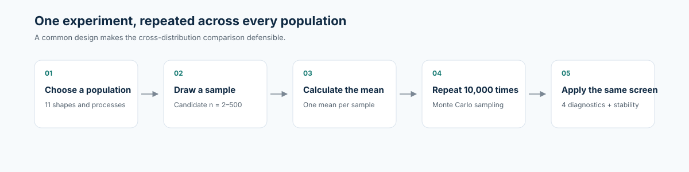
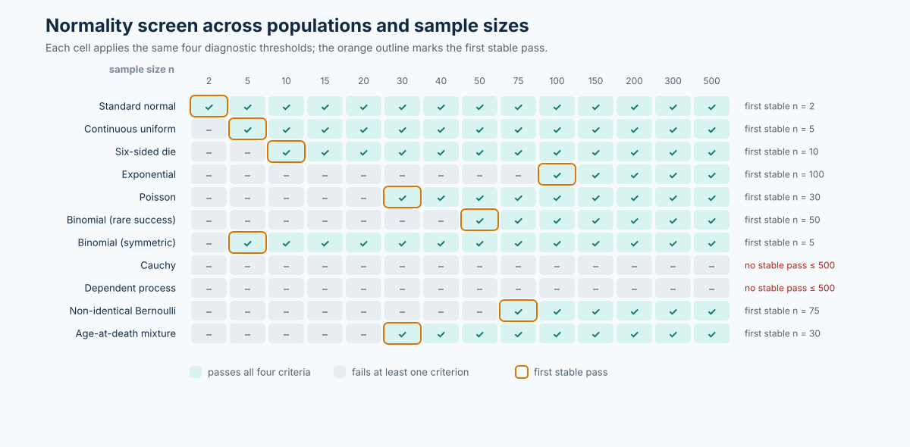
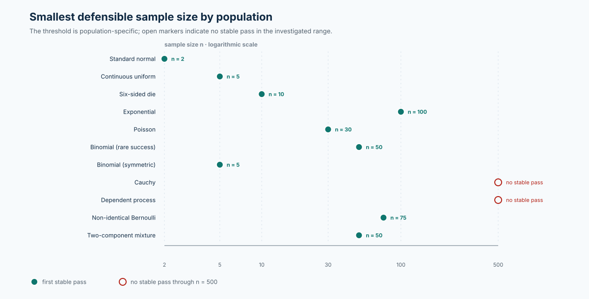

::: {.hero-panel}
<div class="eyebrow">R / QUARTO · STATISTICAL COMPUTING · MONTE CARLO</div>

<p class="hero-question">What is the smallest sample size at which the sampling distribution of a sample mean is reasonably defensible as approximately normal?</p>

<p>This project treats that question as an empirical modeling problem. It applies one transparent decision rule across 11 populations, tests the result with numerical and graphical evidence, and documents where the usual CLT intuition breaks down.</p>

<p class="hero-note">The headline finding: there is no universal “n = 30” switch. The defensible threshold depends on population shape, dependence, tails, and the standard used to define “approximately normal.”</p>
:::

::: {.metric-grid}
::: {.metric-card}
<span class="metric-value">11</span><span class="metric-label">populations and processes compared</span>
:::
::: {.metric-card}
<span class="metric-value">10,000</span><span class="metric-label">Monte Carlo means per candidate n</span>
:::
::: {.metric-card}
<span class="metric-value">4</span><span class="metric-label">pre-specified normality diagnostics</span>
:::
::: {.metric-card}
<span class="metric-value">2–500</span><span class="metric-label">candidate sample sizes investigated</span>
:::
:::

## Visual evidence

<div class="homepage-visual">
<div class="visual-heading"><span class="visual-index">01</span><div><h3>How the experiment works</h3><p>One common simulation design is applied across every population and process.</p></div></div>

</div>

<div class="homepage-visual">
<div class="visual-heading"><span class="visual-index">02</span><div><h3>Where the normality screen passes</h3><p>Green cells pass all four criteria; the orange outline identifies the first stable pass on the candidate grid.</p></div></div>

</div>

<div class="homepage-visual">
<div class="visual-heading"><span class="visual-index">03</span><div><h3>Smallest defensible threshold</h3><p>The result is a population-specific threshold, not a universal n equals 30 rule.</p></div></div>

</div>

<div class="section-kicker">Executive readout</div>

## The result in one minute

The same diagnostic screen produced thresholds from **n = 2** for a standard normal population to **n = 100** for an exponential population. The Cauchy and dependent-process cases did not meet the stability rule through **n = 500**. This range is the central result: sample size alone is not enough to justify a normal approximation.

| Population | First stable pass | Evidence at the selected threshold |
|---|---:|---|
| Standard normal | **n = 2** | Normality is preserved exactly under averaging. |
| Continuous uniform | **n = 5** | Symmetry supports fast convergence. |
| Six-sided die | **n = 10** | Discreteness smooths through averaging. |
| Poisson(1) | **n = 30** | Skewness ≈ 0.142; Q-Q correlation ≈ 0.998. |
| Exponential(1) | **n = 100** | Skewness falls to ≈ 0.189; at n = 30, it is ≈ 0.398. |
| Cauchy | None through 500 | Skewness ≈ 87.46 and excess kurtosis ≈ 8213.51 at n = 500. |

For the full comparison—including rare-success binomial, mixture, non-identical Bernoulli, and dependent-process results—see the [final summary](final-summary.qmd).

## What this project demonstrates

::: {.card-grid}
::: {.project-card}

### Experimental design

Each population is evaluated on the same candidate-n grid with **B = 10,000** simulated sample means per candidate. The seed is reset before each experiment so every result can be reproduced independently.

:::
::: {.project-card}

### Evidence-based judgment

“Approximately normal” is operationalized with skewness, excess kurtosis, normal Q-Q correlation, and standardized Q-Q RMSE. A threshold must pass at three consecutive candidate sizes.

:::
::: {.project-card}

### Assumption awareness

The study deliberately includes skewed, discrete, heavy-tailed, dependent, non-identical, and mixture populations to test the limits of a rule-of-thumb rather than merely confirm it.

:::
:::

## Research question

> What is the smallest sample size at which the sampling distribution of the sample mean is reasonably defensible as approximately normal?

There is no universal answer because “approximately normal” is not a binary population property. It depends on the population being averaged, the diagnostic thresholds, the candidate sample sizes, Monte Carlo variation, and whether the assumptions supporting the CLT are credible.

The professional answer is therefore population-specific: choose the smallest sample size whose numerical and graphical evidence meets a clearly stated standard. This project makes that judgment explicit rather than hiding it behind a single rule of thumb.

## Explore the work

- Start with the [final summary](final-summary.qmd) for the cross-distribution comparison and limitations.
- Open the [individual analyses](analyses/01-normal.qmd) to inspect each population’s prediction, diagnostics, plots, and conclusion.
- Review [`R/helpers.R`](R/helpers.R) for the shared simulation and decision-rule implementation.
- Read the [AI log](ai-log.md) for the prompt record, validation steps, revisions, and remaining modeling assumptions.

## Reproducibility

The project uses base R and a recorded student seed. Replace `student_id <- 6599L` in the analysis files and `R/run_all.R` with the last four digits of the intended student ID, then render from the repository root:

```bash
quarto render --no-clean --cache-refresh
```

The generated website is in `docs/`. The extra Quarto flags avoid the output-directory cleanup/move issue documented in the project README.
